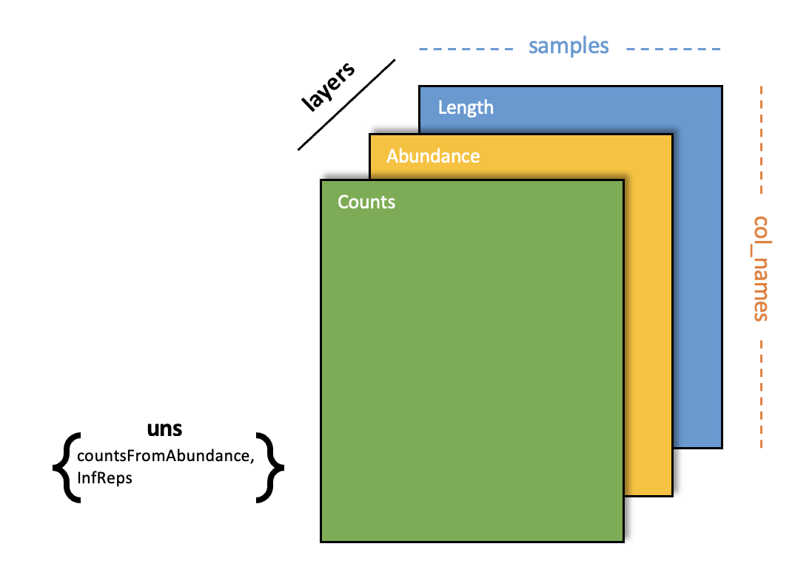
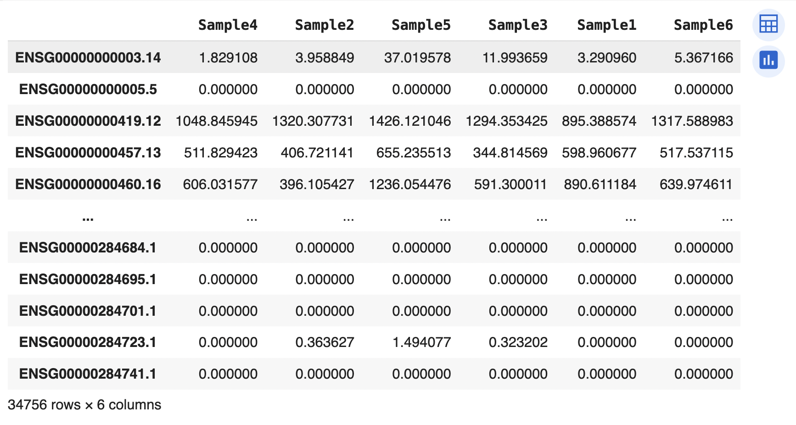
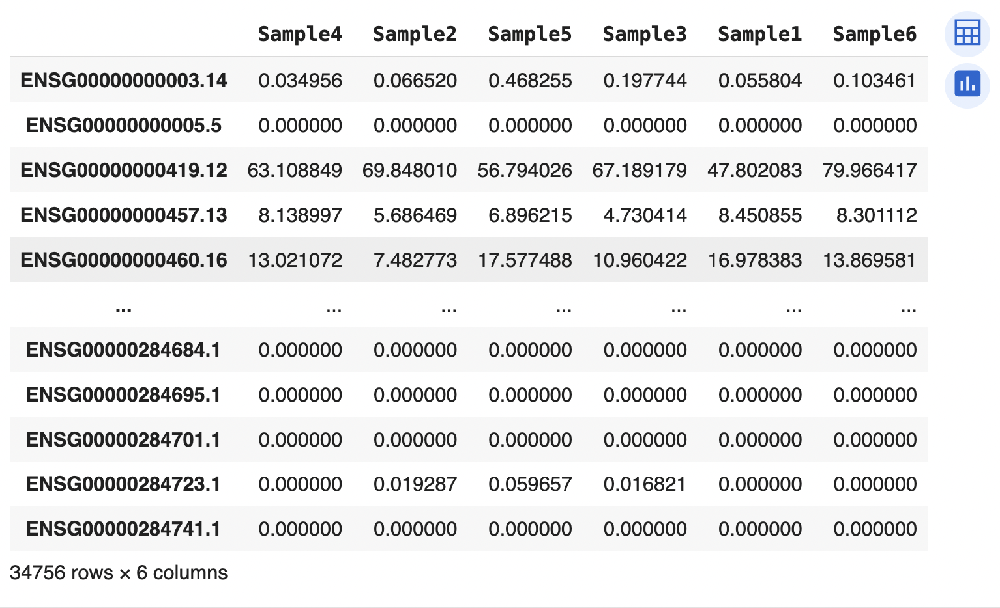
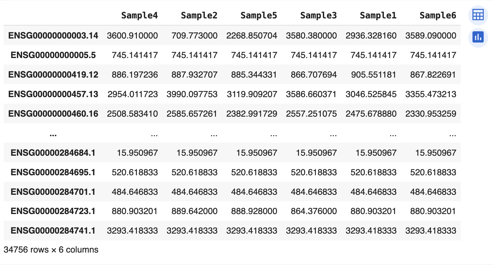
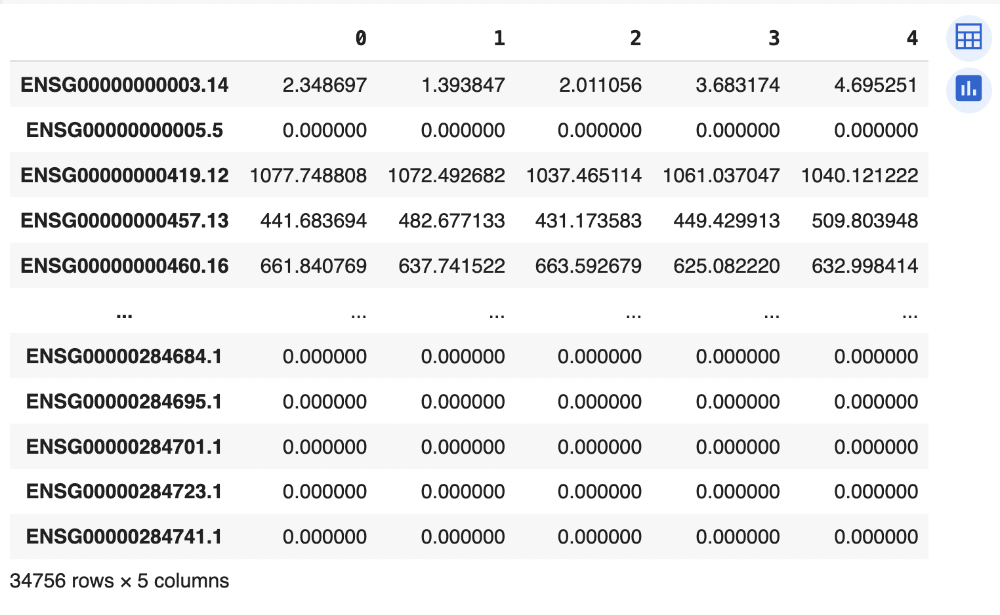
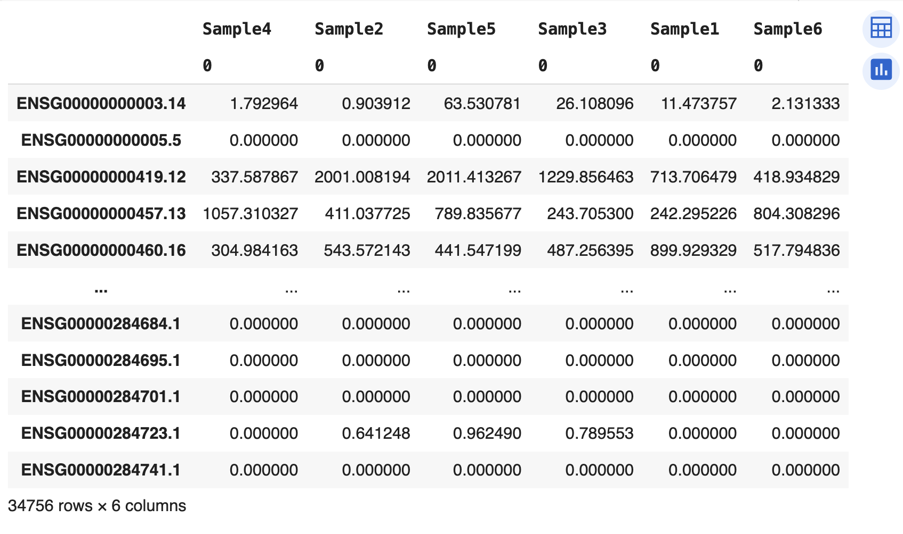

#**Welcome to the pymportx documentation site!**


**`pymportx`** is a Python package designed for fast gene count estimation using transcript quantification files generated by pseudoalignment or quasi-mapping tools. It is a Python adaptation of the widely-used [`tximport`](https://bioconductor.org/packages/release/bioc/html/tximport.html) R package from Bioconductor.


Based on the [`tximport`](https://bioconductor.org/packages/release/bioc/html/tximport.html) R package, it offers the equivalent benefits, including:

* Adjusts for potential variations in gene length between samples.
* Its upstream quantification methods (Salmon, Sailfish, Kallisto, and RSEM) are significantly faster and computationally lighter compared to alignment-based methods that require storage of BAM files.
* Increased sensitivity is achieved by retaining fragments capable of aligning to multiple genes with homologous sequences.

## Prerequisites
-----
****
____

Before installing **`pymportx`**, ensure you have the following prerequisites:

- **Python 3.6 or later**: You can download it from the official [Python website](https://www.python.org/).
- **pip**: The Python package installer. You can install pip by following the instructions [here](https://pip.pypa.io/en/stable/installation/).

## Installation
---

You can install **`pymportx`** via `pip`, the recommended Python package manager. Follow the steps below to install the package:

### 1. Open a terminal or command prompt

Open your terminal (Linux/macOS) or command prompt (Windows).

### 2. Run the following command

Install **`pymportx`** by executing the following pip command:

```bash
pip install pymportx
```

## Data Preparation
---

We will start by creating a list of paths for each sample contained in the output directory of the upstream quantification method used:


```python
folders = ["quant_FilePath_Sample1", "quant_FilePath_Sample2", ...]
#OR
folders = list("quant_FilePath_Sample1", "quant_FilePath_Sample2", ...)
```

Next, the path to a two column transcript annotation file in .csv format must be provided: 

```python
tx2gene = "path/to/tx2gene.csv"
```

Its first column should contain transcript IDs, while the second one must contain gene IDs, as shown below:


## Usage tutorial

#### Salmon

Use the main function `salmon.read_salmon()` with the appropriate arguments described in the [**pymportx**](https://pymportx.readthedocs.io/en/latest/index%20copia/#:~:text=Edit%20on%20GitHub-,pymportx,-Here%20the%20main) section.

```python
from pymportx import salmon

out = salmon.read_salmon(folders,
                         tx_out=False,
                         tx2gene=tx2gene,
                         countsFromAbundance='no')
```


#### Sailfish

Use the main function `sailfish.read_sailfish()` with the appropriate arguments described in the [**pymportx**](https://pymportx.readthedocs.io/en/latest/index%20copia/#:~:text=Edit%20on%20GitHub-,pymportx,-Here%20the%20main) section.

```python
from pymportx import sailfish

out = sailfish.read_sailfish(folders,
                         tx_out=False,
                         tx2gene=tx2gene,
                         countsFromAbundance='no')
```

#### kallisto

Use the main function `kallisto.read_kallisto()` with the appropriate arguments described in the [**pymportx**](https://pymportx.readthedocs.io/en/latest/index%20copia/#:~:text=Edit%20on%20GitHub-,pymportx,-Here%20the%20main) section.

```python
from pymportx import sailfish

out = kallisto.read_kallisto(folders,
                         tx_out=False,
                         tx2gene=tx2gene,
                         countsFromAbundance='no')
```

#### RSEM

Use the main function `rsem.read_rsem()` with the appropriate arguments described in the [**pymportx**](https://pymportx.readthedocs.io/en/latest/index%20copia/#:~:text=Edit%20on%20GitHub-,pymportx,-Here%20the%20main) section.

```python
from pymportx import rsem

out = rsem.read_rsem(folders,
			tx_in=True
			tx_out=False,
			tx2gene=tx2gene,
			countsFromAbundance='no')
```

## Output

The output of our **``pymportx``** package is an [**Anndata**](https://anndata.readthedocs.io/en/latest/) file containing the counts, abundance and legth matrices. Its structure is the following:



**'counts'**: 

	out['counts']



**'abundance'** :

	out['abundance']



**'length'** : 

	out['length']




Additionally, Salmon, Sailfish, and kallisto users have the option to include inferential replicates (`DropInfReps = False`) of each sample in another DataFrame nested dictionary. The DataFrame for the inferential replicates of the first sample:


	out['infReps'][0]




Or even their variance, configuring `varReduce = True` :

	out['variance']




## License

The **pymportx** package is released under [MIT license](https://github.com/victorsanchezarevalo/pymportx/blob/main/LICENSE).
